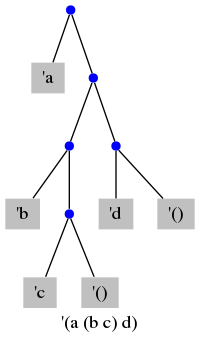

# Homework 2

## 1

### 1a

(setq D (cons 1 (cons (cons 2 3) (cons (cons 4 5) ()))))

### 1b

(cdr (car (cdr D)))

## 2

1. (cons 'c '())
2. (cons 'b (cons 'c '()))
3. (cons 'd '())
4. (cons (cons 'b (cons 'c '())) (cons 'd '()))
5. (cons 'a (cons (cons 'b (cons 'c '())) (cons 'd '())))

// TODO label the tree of numbers

## 3

### 3a

14 bytes

### 3b

12 bytes

### 3c

#### 3c i

offset 196

#### 3c ii

offset 202

#### 3c iii

offset 154

## 4

Check for the number of leading 1's in the byte pointed by p.

If it starts with 10, then this is one of the continuation bytes in the byte array. Skip to the preceding byte and continue checking.

Else, the number of leading 1's indicates the total number of bytes in the byte array.

Now we are at the start of the array and we know how long the array spans, we can convert to Unicode character.

## 5

Arithmetic overflow in C is undefined behavior, there could be 2 possibility:

1. Results in a wrapped around value. In this case we can check whether k is less than either i or j or not. If it does, then we have overflow.
2. Results in a negative number. In this case we can check whether k is < 0 or not. If it does, then we have overflow.

## 6

### 6a C

For data structure, I would define a struct AstNode that contains 2 pointers to the left and right children AstNode nodes.

To make sure the memory allocation of all nodes of an AST is reclaimed correctly, I would use recursive tree traversal strategy.

freeAst(struct AstNode* node) {
  if (node == null) {
    return;
  }
  freeAst(node->left);
  freeAst(node->right);
  free(node);
}

### 6b C++

For data structure, I would define a struct AstNode that contains 2 unique_ptr<AstNode> to the left and right children AstNode.

Since we're using smart pointer unique_ptr, when the smart pointer runs out-of-scope, the memory is reclaimed automatically.

### 6c Rust

Rust has an ownership and borrowing system, so memory management is handled automatically. The data structure of AstNode would be a struct containing 2 references to the left and right children AstNode.

## 7

I would define an unsigned char pointer pointing to the double (will need to typecast the double to unsigned char when assigning). I use unsigned char because it has size of 1 byte.

Then iterate using a for loop to access the value of each byte of the double. (Increment the unsigned char pointer at the end of each iteration).

## 8

## 9

